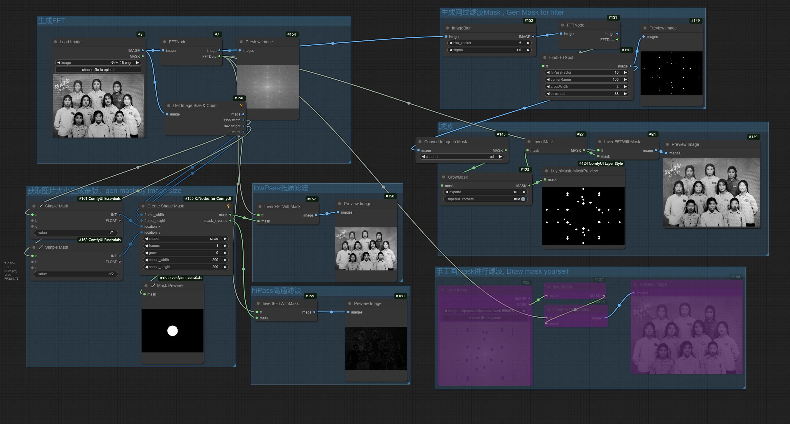

# ComfyUI_FFT
对图片进行快速傅里叶变换，然后用户可以自由选择滤波范围对图片进行滤波。主要作用是去除图片上的网格纹路，还可以进行高通滤波和低通滤波。详细工作流如下图。PNG文件里包含ComfyUI工作流。工作原理类似Photoshop的FFT滤镜

Perform a Fast Fourier Transform on the image, and then users can freely select the filtering range to filter the image. The main function is to remove the grid patterns on the image, and it can also perform high-pass filtering and low-pass filtering. The detailed workflow is shown in the figure below. The PNG file contains the ComfyUI workflow.The working principle is similar to the FFT filter in Photoshop.

